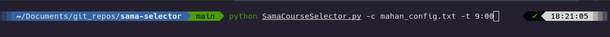

# Sama Course Selector



## What does this script do?

Course selection for Universities with SamaSoft system (سامانه آموزشی سما) has always been a major hassle for me and my collegemates. This is due to the fact that this system requires an excessive amount of browser requests to select the courses (making the procedure very inefficent). This puts a unnecessarily large load on university's servers and usually results in the servers going down.

This script aims to execute the procedure in a single request. It should take a few seconds to select all of your desired courses while putting much less load on the servers.

## Installation

First, you'll need to clone this repository to your local drive via the following command:

```shell
$ git clone https://github.com/Mahan-AK/sama-selector.git
```

Alternatively, if you don't have `git` installed, you can download the zip file for this repository and extract it.

## Requirements

This script is written in python 3 and requires selenium and requests libraries.

You can install the required libraries by running the following command:

```shell
$ pip install -r requirements.txt
```

If that command results in an error, you can also try:

```shell
$ python -m pip install -r requirements.txt
```

## Usage

First, You will need to edit config.txt file and fill the required fields (you can find an example config file [here](docs/example_config.txt)):

| Variable  | Description  |
| :------------: |:---------------:|
| **host** | Sama main website |
| **term** | Current term code</br>(Check config.txt for more info) |
| **std_num** | Student ID |
| **passwd**[^pass] | Sama password |
| **std_sel** | List of desired courses to select |

[^pass]: Providing a password in config file is not necessary (for privacy reasons), you can provide your password in the login page.

Now we can run the code:

```shell
$ cd sama-selector
$ python SamaCourseSelector.py -c CONFIG_FILE -t ACTION_TIME
```

Program Usage[^time]:

```
Usage: python SamaCourseSelector.py -c path_to_config_file -t starting_time

Example: python SamaCourseSelector.py -c config.txt -t 9:00

Options:
-h, --help      show this help message and exit
-c CONFIG_FILE  
-t ACTION_TIME
```
[^time]: ACTION_TIME option should be provided in 24 hour format.
